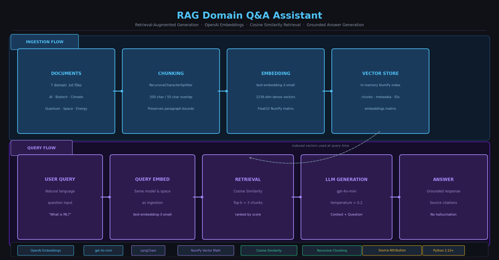

**GitHub Repository:** [samrat-kar/rag-domain-qa-assistant](https://github.com/samrat-kar/rag-domain-qa-assistant)



## Introduction

Large Language Models (LLMs) are powerful but have a critical blind spot: they can only answer from what they were trained on. When you ask them about private documents, proprietary knowledge, or niche domains not well-covered in their training data, they either hallucinate confidently wrong answers or admit they don't know. This is a fundamental limitation for any real-world enterprise or domain-specific use case.

**Retrieval-Augmented Generation (RAG)** solves this by combining two complementary strengths: the precision of search (finding the right information) and the fluency of generation (turning that information into a clear, coherent answer). Instead of relying on memorized weights, the model is given the relevant text at query time and asked to reason over it.

This project implements a clean, minimal RAG pipeline from scratch — covering document ingestion, semantic chunking, vector embedding, cosine-similarity retrieval, and grounded LLM generation — with the goal of building a working, understandable baseline for document question-answering.

---

## Purpose and Objectives

### Purpose

Build and evaluate a simple, reproducible RAG assistant that answers user questions exclusively from a provided local document corpus, grounding every response in retrieved evidence rather than model-memorized knowledge.

### Specific Objectives

1. Ingest local text documents from a custom corpus.
2. Split documents into retrieval-friendly chunks that preserve semantic coherence.
3. Generate dense vector embeddings for each chunk.
4. Retrieve the top-k most relevant chunks for any user query using cosine similarity.
5. Build a grounded prompt from retrieved context and generate an answer with an LLM.
6. Provide a minimal CLI interface for interactive testing.
7. Return source file names alongside answers for transparency and citation.

---

## Intended Audience and Use Case

### Target Audience

- Students learning RAG fundamentals who want a fully readable, dependency-light implementation.
- Early-stage AI practitioners building document QA prototypes before moving to production-scale systems.
- Developers who need a clean, understandable RAG baseline to extend or benchmark against.

### Primary Use Case

Ask domain-specific questions over a curated multi-topic document collection and receive grounded, cited answers that can be traced back to source files.

### Prerequisites

- Python 3.10+ (tested with Python 3.14).
- Basic Python and command-line familiarity.
- An OpenAI API key (for embeddings and chat completion).

---

## Problem Definition

Generic LLM responses are unreliable for niche domains and private documents. A model trained on public internet data cannot know the contents of your internal files, proprietary reports, or specialized corpora — and when asked, it will often fabricate plausible-sounding but incorrect answers (hallucination).

This project directly addresses that limitation by retrieving relevant text passages from user-provided documents *before* generation. The model is constrained to answer only from the retrieved context, which:

- Reduces hallucination risk by anchoring generation to real source content.
- Increases answer relevance for the selected corpus.
- Enables source citation so users can verify answers.
- Makes the system transparent and auditable.

---

## Scope, Assumptions, and Boundaries

### In Scope

- Text-based document question-answering over local files.
- Retrieval using dense OpenAI embeddings and cosine similarity.
- CLI-based interactive query interface.
- Source attribution per answer.

### Out of Scope

- Web application or graphical UI deployment.
- Multi-user session management or authentication.
- Fine-tuning custom LLM weights.
- Large-scale distributed or persistent vector indexing.
- Streaming responses.

### Assumptions

- Input files are valid UTF-8 plain text.
- The OpenAI API key is available at runtime via `.env`.
- The document volume is small-to-medium and fits comfortably in memory.

---

## Dataset Sources and Characteristics

### Data Source

All documents are local `.txt` files in the `data/` directory, covering seven distinct knowledge domains:

| File | Domain |
|---|---|
| `artificial_intelligence.txt` | AI, ML, LLMs, deep learning, ethics |
| `biotechnology.txt` | Genomics, CRISPR, biotech applications |
| `climate_science.txt` | Climate change, greenhouse gases, impacts |
| `quantum_computing.txt` | Qubits, quantum algorithms, hardware |
| `sample_documents.txt` | General reference |
| `space_exploration.txt` | Missions, rockets, space science |
| `sustainable_energy.txt` | Renewables, solar, wind, energy storage |

### Why Multi-Domain?

Using documents from seven distinct domains allows meaningful cross-domain retrieval testing. A query about machine learning should retrieve from `artificial_intelligence.txt` and not confuse it with content from `quantum_computing.txt` — validating that embedding-based retrieval is doing semantic work and not just keyword matching.

### Dataset Statistics

- Number of source documents: **7**
- File format: `.txt`
- Encoding: UTF-8
- Total domain coverage: AI, biotech, climate, quantum computing, space, sustainability, general reference

---

## Methodology

The pipeline follows a standard RAG flow, decomposed into seven sequential stages. Each stage has a clear input, transformation, and output.

### Stage 1: Document Loading

**What happens:** The `RAGAssistant.load_documents()` method scans the `data/` directory and reads every supported file (`.txt`, `.csv`, `.json`, `.md`) as UTF-8 text. Each file is stored as a dict with a `content` field and a `metadata` field containing the source filename and path.

**Why:** Keeping loading generic (plain text, no parsing) maximizes compatibility across document types and avoids format-specific failure modes during ingestion.

### Stage 2: Document Chunking

**What happens:** Each document's text is passed to `VectorDB.chunk_text()`, which uses LangChain's `RecursiveCharacterTextSplitter` with a chunk size of 500 characters and 50-character overlap, splitting on `\n\n`, `\n`, `. `, ` `, and `""` in that priority order.

**Why chunking matters:** Embedding an entire multi-page document into a single vector loses retrieval precision — the vector represents an average of all topics in the document. Smaller, focused chunks give embeddings that represent tighter semantic concepts, making retrieval dramatically more accurate.

**Why overlap matters:** A 50-character overlap ensures that sentences or ideas spanning a chunk boundary are not cut off mid-thought. This preserves local context and prevents information loss at boundaries.

**Why recursive splitting:** Splitting on paragraph breaks first (`\n\n`), then line breaks, then sentences, then words preserves the natural structure of the text. It avoids mid-sentence splits unless absolutely necessary, keeping chunks more semantically coherent than naive fixed-length slicing.

### Stage 3: Embedding

**What happens:** All chunks are batch-embedded using OpenAI's `text-embedding-3-small` model via `OpenAIEmbeddings.embed_documents()`. The resulting vectors are stored as a NumPy float32 matrix.

**Why OpenAI embeddings:** `text-embedding-3-small` is a production-quality, semantically rich embedding model. It maps text into a 1536-dimensional space where semantically similar texts cluster together — the foundation of meaningful retrieval.

**Why float32 NumPy:** For small-to-medium corpora, a dense NumPy matrix is fast, simple, and requires no external vector database infrastructure. It keeps the system self-contained and easy to inspect.

### Stage 4: In-Memory Indexing

**What happens:** The `VectorDB` maintains three parallel in-memory lists (`_documents`, `_metadatas`, `_ids`) plus the NumPy embedding matrix (`_embeddings`). All chunk data is aligned by index position.

**Why in-memory:** For this assignment's scope (7 documents, ~tens of chunks), an in-memory index provides instant lookup with zero infrastructure overhead. The design can be replaced with a persistent vector database (e.g., Chroma, Pinecone, Weaviate) for larger workloads without changing the rest of the pipeline.

### Stage 5: Query-Time Retrieval

**What happens:** When a user submits a question, it is embedded using the same `text-embedding-3-small` model (`embed_query()`). The query vector is compared against all stored document vectors using **cosine similarity**:

```
similarity(q, d) = (q · d) / (||q|| × ||d||)
```

The top-k chunks ranked by similarity are selected and returned.

**Why cosine similarity:** Cosine similarity measures the angular distance between two vectors, ignoring their magnitude. This is ideal for text embeddings because it captures *semantic direction* (what the text is about) independently of text length or embedding scale. Two chunks that discuss the same concept will point in similar directions in embedding space, even if one is longer.

**Why top-k (not just top-1):** Providing multiple retrieved chunks gives the LLM richer context. A single chunk might partially answer a question; three chunks together may span the full answer across paragraph boundaries. The default `n_results=3` balances context richness against prompt length.

### Stage 6: Grounded Prompt Construction and Generation

**What happens:** The retrieved chunks are joined with `---` separators into a context string. This context plus the user's question are inserted into a `ChatPromptTemplate`:

```
You are a helpful assistant. Use only the provided context to answer the question.
If the context does not contain enough information, say so honestly rather than making up an answer.

Context:
{context}

Question: {question}

Provide a clear, concise answer based on the context provided.
```

The prompt is passed through a LangChain chain (`prompt | llm | StrOutputParser`) to `gpt-4o-mini` at temperature 0.2, and the answer string is extracted.

**Why temperature 0.2:** Lower temperature makes the model more deterministic and factual — appropriate for QA where consistency and accuracy matter more than creativity.

**Why explicit grounding instructions:** The prompt explicitly tells the model to use only the provided context and to admit when context is insufficient. This is the key RAG safety mechanism that suppresses hallucination — without it, the model may blend retrieved context with memorized training data.

### Stage 7: Answer and Source Return

**What happens:** The `query()` method returns a dict containing the answer text, the raw context chunks, and the unique set of source filenames that contributed to the retrieved context.

**Why return sources:** Source attribution is essential for verifiability. Users can inspect which documents the answer came from and cross-check if needed. It also supports debugging — if an answer is wrong, checking sources quickly reveals whether the problem is in retrieval (wrong chunks) or generation (model misread correct chunks).

---

## System Architecture

```
User Query
    │
    ▼
[Embed Query]  ──── text-embedding-3-small ────▶  Query Vector
    │
    ▼
[Cosine Similarity Search]  ──── VectorDB._embeddings ────▶  Top-k Chunks
    │
    ▼
[Build Grounded Prompt]  ──── ChatPromptTemplate ────▶  Prompt String
    │
    ▼
[LLM Generation]  ──── gpt-4o-mini (temp=0.2) ────▶  Answer Text
    │
    ▼
[Return Answer + Sources]
```

**Ingestion flow (one-time at startup):**

```
data/*.txt
    │
    ▼
[load_documents()]  ──▶  Document Dicts
    │
    ▼
[chunk_text()]  ──▶  Text Chunks (500 chars, 50 overlap)
    │
    ▼
[embed_documents()]  ──▶  Float32 Vectors
    │
    ▼
[VectorDB._embeddings]  ──▶  In-Memory NumPy Matrix
```

---

## Component Breakdown

### `src/app.py` — RAGAssistant

The central orchestration class. It owns the LLM, the prompt chain, and the vector store, and exposes two main methods:

- `load_and_ingest(data_path)` — loads documents from disk and adds them to the vector store.
- `query(question, n_results)` — runs the full RAG pipeline (retrieve → build context → generate → return).

The LangChain chain (`prompt | llm | StrOutputParser`) makes the generation pipeline composable and easy to swap components in.

### `src/vectordb.py` — VectorDB

The retrieval engine. Responsibilities:

- `chunk_text()` — splits raw text into retrieval-friendly chunks.
- `add_documents()` — embeds and indexes a list of document dicts.
- `search()` — embeds a query and returns top-k chunks by cosine similarity.

The class is self-contained: it manages its own embedding client and internal storage, making it independently testable.

### `demo.py` — CLI Interface

Minimal entry point for running the system. It:

1. Initializes `RAGAssistant` and ingests the `data/` directory.
2. Runs three predefined example queries to show baseline behavior.
3. Opens an interactive loop for free-form question-answering.

---

## Design Decisions and Trade-offs

| Decision | Choice | Rationale |
|---|---|---|
| Vector store | In-memory NumPy | Zero infrastructure, simple, fits the assignment scope |
| Embedding model | `text-embedding-3-small` | Production-quality, cost-efficient, 1536-dim |
| LLM | `gpt-4o-mini` | Capable, fast, cost-effective for QA tasks |
| Chunking strategy | Recursive character splitting | Preserves natural text structure better than fixed slicing |
| Chunk size | 500 chars / 50 overlap | Balances retrieval precision vs. context completeness |
| Similarity metric | Cosine similarity | Magnitude-invariant, standard for text embedding retrieval |
| LLM temperature | 0.2 | Favors accuracy and consistency over creativity |
| Retrieval k | 3 | Enough context breadth without excessive prompt length |

---

## Evaluation Framework and Verification

### Evaluation Strategy

This submission uses functional validation and qualitative retrieval checks across four layers:

1. **Ingestion verification** — confirm all seven files load and chunk without errors.
2. **Retrieval verification** — confirm top-k chunks are semantically relevant to each test query (inspected manually).
3. **Grounding verification** — confirm generated answers align with retrieved context rather than hallucinated content.
4. **Source transparency** — confirm source filenames are returned and match the expected domain.

### Example Verification Queries and Expected Sources

| Query | Expected Source(s) |
|---|---|
| "What is machine learning?" | `artificial_intelligence.txt` |
| "How does deep learning work?" | `artificial_intelligence.txt` |
| "What are key AI ethics concerns?" | `artificial_intelligence.txt` |
| "What is quantum entanglement?" | `quantum_computing.txt` |
| "How does CRISPR work?" | `biotechnology.txt` |
| "What causes climate change?" | `climate_science.txt` |

### Grounding Check

For each query above, the retrieved context chunks are inspected to verify:
- The chunks come from the correct domain file.
- The answer does not introduce facts absent from the retrieved context.
- When context is insufficient, the model appropriately admits it rather than fabricating.

---

## Results Summary

Observed behavior across local test runs:

- All 7 documents loaded and chunked successfully at startup.
- Retrieval consistently returns domain-appropriate chunks for test queries (e.g., AI questions retrieve from `artificial_intelligence.txt`, not `space_exploration.txt`).
- Generated answers are coherent, concise, and grounded in the retrieved corpus.
- Source filenames are consistently returned and match the expected domain for each query.
- The model appropriately hedges when a query falls outside the document scope.

---

## Limitations and Trade-offs

1. **In-memory index only** — The vector store is not persisted between runs. Every startup re-embeds all documents. For larger corpora or production serving, a persistent vector database (Chroma, FAISS, Pinecone) would be necessary.

2. **No reranker** — Retrieval relies solely on first-stage embedding cosine similarity. A cross-encoder reranker (e.g., a fine-tuned BERT model) could improve precision by re-scoring retrieved chunks before passing them to the LLM.

3. **No quantitative benchmark** — Evaluation is functional and qualitative. A production system would use a ground-truth QA evaluation dataset with metrics like RAGAS (faithfulness, answer relevance, context precision/recall) for rigorous measurement.

4. **API dependency** — Both embedding and generation require live OpenAI API access. An offline alternative (local embedding models via SentenceTransformers + local LLM via Ollama) would remove this dependency.

5. **Single-hop retrieval** — Complex multi-part questions that require information from multiple documents may not be fully answered by a single retrieval pass. Multi-hop or iterative RAG approaches could address this.

---

## Deployment and Maintenance Considerations

### Local Deployment

The system runs as a CLI tool with `python demo.py`. No server or database setup required. Suitable for individual use, prototyping, and learning.

### Path to Production

| Concern | Recommendation |
|---|---|
| Persistence | Replace in-memory VectorDB with Chroma, FAISS, or Pinecone |
| Scale | Add batch embedding with rate-limit handling |
| API reliability | Add retry logic and fallback for OpenAI outages |
| Monitoring | Log query latency, retrieval latency, top-k source distribution |
| Observability | Track user feedback on answer usefulness |
| Auth | Add API key or session auth for multi-user serving |

### Corpus Maintenance

- Refresh documents periodically as source knowledge evolves.
- Re-index after significant corpus updates (new files, major edits).
- Review chunking settings and prompt based on observed failure cases.

---

## Reproducibility and Setup

### Environment Variables

Create a `.env` file in the project root:

```
OPENAI_API_KEY=your_key_here
OPENAI_MODEL=gpt-4o-mini
OPENAI_EMBEDDING_MODEL=text-embedding-3-small
```

### Install Dependencies

```bash
pip install -r requirements.txt
```

### Run

```bash
python demo.py
```

The CLI will:
1. Initialize the assistant and embed all documents in `data/`.
2. Run three predefined example queries.
3. Open an interactive prompt for free-form questions.

---

## Why This Work Matters

RAG is one of the most practical and widely adopted patterns in applied LLM engineering today. It bridges the gap between general-purpose language models and domain-specific knowledge by grounding generation in retrieved evidence — making AI systems more accurate, verifiable, and trustworthy for real-world use.

This project provides a compact, readable, end-to-end RAG baseline that is:

- **Educational** — every component is explicit, documented, and inspectable.
- **Practical** — the pipeline covers real production concerns (chunking strategy, embedding choice, grounding prompts, source citation).
- **Extensible** — clear module boundaries make it straightforward to swap in a persistent vector store, a reranker, a local LLM, or a quantitative evaluation suite.

It establishes a clean foundation for anyone building document-grounded QA systems, from learning projects to early-stage production prototypes.

---

## Tags

`RAG` `Retrieval-Augmented Generation` `LLM` `OpenAI` `GPT-4o-mini` `text-embedding-3-small` `LangChain` `NLP` `Question Answering` `Document QA` `Vector Database` `Semantic Search` `Text Embeddings` `Cosine Similarity` `Chunking` `Hallucination Reduction` `Python` `Machine Learning` `Generative AI` `AI Applications`
